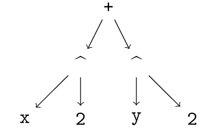

# TreeView

[](https://github.com/JuliaTeX/TreeView.jl/actions)
[](https://codecov.io/gh/JuliaTeX/TreeView.jl)


This is a small package to visualize a graph corresponding to an
abstract syntax tree (AST) of a Julia expression. It uses the `TikzGraphs.jl`
package to do the visualization.

## Usage

The package is designed to be used within the IJulia notebook.

The simplest usage is `@tree <EXPRESSION>`, where `<EXPRESSION>` represents any
Julia expression, for example
```
@tree x^2 + y^2
```
which gives the following output:



See [this notebook](https://github.com/JuliaTeX/TreeView.jl/blob/master/examples/TreeView%20usage.ipynb) for usage examples.

## Installation prerequisites

You will need to have `LaTeX` installed on your system, and install the `pdf2svg` utility; see
the [`TikzGraphs.jl` documentation](http://nbviewer.jupyter.org/github/sisl/TikzGraphs.jl/blob/master/doc/TikzGraphs.ipynb) for details.

## Author

- [David P. Sanders](http://sistemas.fciencias.unam.mx/~dsanders),
Departamento de Física, Facultad de Ciencias, Universidad Nacional Autónoma de México (UNAM)

## Acknowledements
Financial support is acknowledged from DGAPA-UNAM PAPIME grants PE-105911 and PE-107114, and DGAPA-UNAM PAPIIT grant IN-117214, and from a CONACYT-Mexico sabbatical fellowship. The author thanks Alan Edelman and the Julia group for hospitality during his sabbatical visit.

In particular, he thanks Jiahao Chen, who, when asked if a package like this existed,
replied "why don't you write one?".
